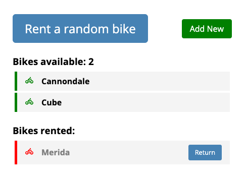

## Task:

> Design an ObjectMgr which manages a pool of objects. Objects can be considered to be ints (from 1 to n). It should provide api's to get_object() and free_object().

> get_object(): It returns any object , available in the pool. An object cannot be given away again, unless it has been freed.

> free_object(int obj): It returns the obj back to the pool, so that it can be given out again.

> Also provide a single page front-end to use this API. Discuss the api's definitions, data structures and write tests.

> Follow-on:

> 1. Write a Rest API /object to use the above functions to create, get and free objects.

> 2. Deploy it as a service/container that can be used to deploy on a linux server.

> Feel free to use Python and React to implement this along with any standard libraries.

## Solution explaining

This task definition is similar to renting smth. You get something random (bicycle, scooter, car). While the item is rented, it's unavailable for renting by other users. When you are returning an item (free), it became available again. 
I decided to simulate the task of renting a bike as less abstract and more life-related.

## Run the following commands to deploy the project locally:

1. pip install pipenv
2. pipenv install && pipenv shell
3. cd ./code/
4. python manage.py createsuperuser or use default "admin/admin"
5. python manage.py runserver
6. yarn && yarn start

## Running tests:

Call `pytest` from `/code` directory.
